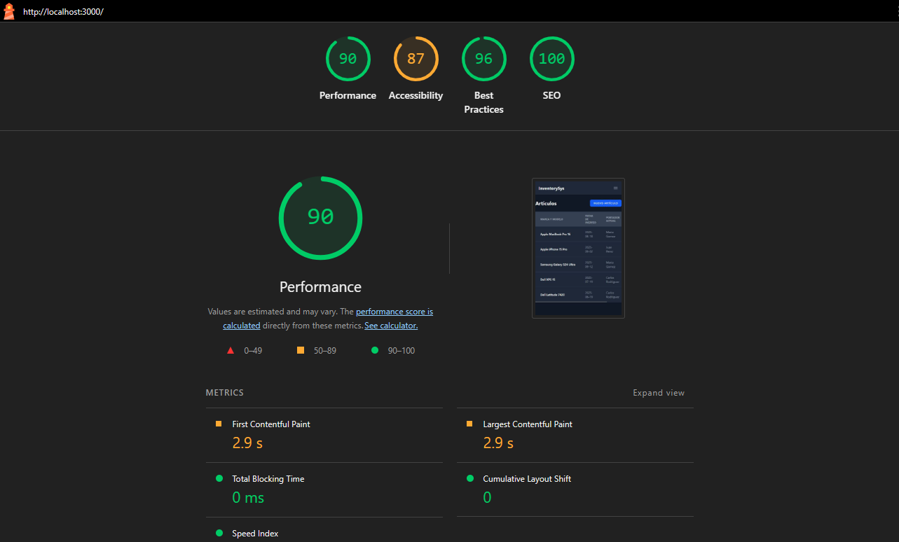

# Sistema de Control de Inventario

Aplicación web desarrollada con Ruby on Rails 8 para la gestión de artículos, personas y sus transferencias de posesión. El proyecto está completamente contenedorizado con Docker para garantizar una configuración de desarrollo rápida y consistente.

## Características Principales

- **Gestión de Artículos:** Alta, baja y modificación de artículos, incluyendo su modelo, marca y fecha de ingreso.
- **Gestión de Personas:** Administración de las personas que pueden poseer artículos.
- **Sistema de Transferencias:** Registro de la transferencia de un artículo de una persona a otra, manteniendo un historial completo.
- **ABM de Marcas y Modelos:** Módulos dedicados para gestionar las marcas y modelos disponibles.
- **Autenticación de Usuarios:** Sistema de registro e inicio de sesión para proteger el acceso a la aplicación.
- **Interfaz Moderna y Responsiva:** UI desarrollada con Tailwind CSS y componentes de Flowbite, incluyendo un modo oscuro.

## Tecnologías Utilizadas

- **Backend:** Ruby on Rails 8
- **Base de Datos:** SQLite 3
- **Frontend:**
  - Hotwire (Turbo & Stimulus)
  - Tailwind CSS
  - Flowbite
  - Alpine.js (para interacciones de UI)
- **Entorno de Desarrollo:** Docker y Docker Compose

---

## Puesta en Marcha (Instalación y Ejecución)

Este proyecto está diseñado para ejecutarse dentro de un contenedor de Docker. No es necesario instalar Ruby o Rails en la máquina anfitriona.

### Prerrequisitos

- [Docker](https://www.docker.com/)
- [Docker Compose](https://docs.docker.com/compose/)
  (Ambos vienen incluidos con la instalación de Docker Desktop)

### Pasos de Instalación

1.  **Clonar el repositorio:**
    ```bash
    git clone https://github.com/tu-usuario/inventory_system.git
    cd inventory_system
    ```

2.  **Construir la imagen de Docker:**
    ```bash
    docker compose build
    ```

3.  **Crear y preparar la base de datos:**
    ```bash
    docker compose run --rm web rails db:create
    docker compose run --rm web rails db:migrate
    docker compose run --rm web rails db:seed
    ```

4.  **Iniciar la aplicación:**
    ```bash
    docker compose up
    ```

La aplicación estará disponible en tu navegador en la siguiente dirección: **[http://localhost:3000](http://localhost:3000)**

### Credenciales de Acceso

Una vez que la aplicación esté en marcha, puedes iniciar sesión con el siguiente usuario de prueba creado por el script de `seeds`:

-   **Usuario:** `test@example.com`
-   **Contraseña:** `password`

---

## Calidad y Rendimiento

El proyecto se ha auditado utilizando Google Lighthouse para garantizar altos estándares de calidad en las áreas clave de la web. Los resultados demuestran un rendimiento excelente y el cumplimiento de las mejores prácticas modernas.



| Métrica          | Puntuación |
| ---------------- | :--------: |
| ✅ **Performance** |     90     |
| 🟠 **Accessibility** |     87     |
| ✅ **Best Practices**|     96     |
| ✅ **SEO**         |    100     |

---

## Flujo de Trabajo de Desarrollo

-   **Ejecutar la suite de pruebas:**
    Para verificar que toda la aplicación funciona correctamente después de realizar cambios, ejecuta la suite de pruebas completa. Todos los tests deben pasar.
    ```bash
    docker compose run --rm web rails test
    ```

-   **Ejecutar otros comandos de Rails:**
    Para la mayoría de las tareas de desarrollo (consola, generadores, migraciones, etc.), utiliza el prefijo `docker compose run --rm web`:
    ```bash
    # Abrir la consola de Rails
    docker compose run --rm web rails c

    # Crear una nueva migración
    docker compose run --rm web rails g migration AddDetailsToArticulos
    ```

-   **Para detener la aplicación**, presiona `Ctrl + C` en la terminal donde ejecutaste `docker compose up`.

## Diseño y Planificación

### Modelo de Datos (Entidad-Relación)

El sistema se estructura en torno a 5 modelos principales:

-   `Marca`: Contiene el nombre de un fabricante (ej. Apple, Samsung).
    -   `has_many :modelos`
-   `Modelo`: Representa un producto específico de una marca (ej. MacBook Pro 16).
    -   `belongs_to :marca`
    -   `has_many :articulos`
-   `Persona`: Representa a un individuo que puede poseer artículos.
    -   `has_many :articulos` (los que posee actualmente)
    -   `has_many :transferencias`
-   `Articulo`: Una instancia física única de un modelo.
    -   `belongs_to :modelo`
    -   `belongs_to :persona` (el portador actual)
    -   `has_many :transferencias`
-   `Transferencia`: Registra el evento de un artículo siendo asignado a una persona en un momento específico.
    -   `belongs_to :articulo`
    -   `belongs_to :persona`

### Planificación del Proyecto (Checklist)

- [x] Configuración inicial del proyecto con Rails 8 y Docker.
- [x] Creación de modelos y migraciones de base de datos.
- [x] Scaffolding básico para Artículos y Personas.
- [x] Implementación de datos de prueba (seeds).
- [x] Lógica de negocio principal: Módulo de Transferencias.
- [x] Refinamiento de vistas para mostrar historiales.
- [x] Implementación de ABM de Marcas y Modelos.
- [x] Integración de Tailwind CSS, Flowbite y Alpine.js.
- [x] Implementación de modo oscuro y UI responsiva.
- [x] Implementación de sistema de autenticación de usuarios.
- [x] Pruebas unitarias (Minitest).