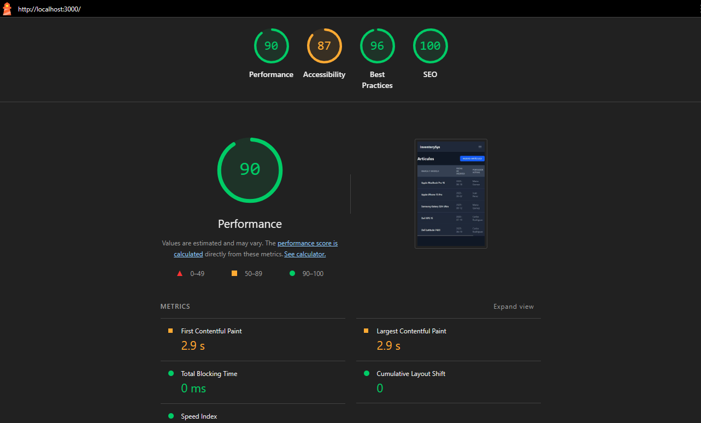

# Sistema de Control de Inventario

Aplicación web desarrollada con Ruby on Rails 8 para la gestión de artículos, personas y sus transferencias de posesión. El proyecto está completamente contenedorizado con Docker para garantizar una configuración de desarrollo rápida y consistente.

## Características Principales

- **Gestión de Artículos:** Alta, baja y modificación de artículos, incluyendo su modelo, marca y fecha de ingreso.
- **Gestión de Personas:** Administración de las personas que pueden poseer artículos.
- **Sistema de Transferencias:** Registro de la transferencia de un artículo de una persona a otra, manteniendo un historial completo.
- **ABM de Marcas y Modelos:** Módulos dedicados para gestionar las marcas y modelos disponibles.
- **Importación con IA:** Funcionalidad para crear Marcas y Modelos a partir de una imagen del producto, utilizando una API de IA para extraer la información.
- **Sistema de Roles y Permisos:** Distinción entre usuarios Administradores (con acceso total) y usuarios Estándar (con vista restringida a sus propios artículos).
- **Historial Global y Exportación:** Módulo de auditoría para administradores que muestra todas las transferencias del sistema y permite exportar los datos a formato Excel (.xlsx).
- **Autenticación de Usuarios:** Sistema de registro, inicio de sesión e invitación para proteger el acceso a la aplicación.
- **Interfaz Moderna y Responsiva:** UI desarrollada con Tailwind CSS, incluyendo un modo oscuro.

## Tecnologías Utilizadas

- **Backend:** Ruby on Rails 8, Pundit (para autorización).
- **Base de Datos:** SQLite 3
- **Exportación de Datos:** `caxlsx_rails` para la generación de archivos Excel.
- **Frontend:**
  - Hotwire (Turbo & Stimulus)
  - Tailwind CSS
  - Alpine.js
- **Entorno de Desarrollo:** Docker y Docker Compose
- **Servicios Externos:** OpenRouter API (para la importación con IA).

---

## Puesta en Marcha (Instalación y Ejecución)

Este proyecto está diseñado para ejecutarse dentro de contenedores de Docker. No es necesario instalar Ruby o Rails en la máquina anfitriona.

### Prerrequisitos

- [Docker](https://www.docker.com/) y [Docker Compose](https://docs.docker.com/compose/) (incluidos en Docker Desktop).
- Una clave de API de [OpenRouter.ai](https://openrouter.ai/) para la funcionalidad de importación de imágenes.

### Pasos de Instalación

1.  **Clonar el repositorio:**
    ```bash
    git clone https://github.com/tu-usuario/inventory_system.git
    cd inventory_system
    ```

2.  **Configurar las variables de entorno:**
    Copia el archivo de ejemplo `.env.example` a un nuevo archivo llamado `.env` y añade tu clave de API de OpenRouter.
    ```bash
    cp .env.example .env
    # Ahora edita el archivo .env y pega tu clave
    ```

3.  **Construir las imágenes de Docker:**
    Este comando leerá el `Dockerfile` y `Gemfile` para instalar todas las dependencias necesarias.
    ```bash
    docker compose build
    ```

4.  **Crear y preparar la base de datos:**
    Estos comandos se ejecutan dentro del contenedor de la aplicación y pueblan la base de datos con datos de ejemplo.
    ```bash
    docker compose run --rm web rails db:prepare
    docker compose run --rm web rails db:seed
    ```
    *(Nota: `db:prepare` crea la base de datos y ejecuta las migraciones).*

5.  **Iniciar la aplicación:**
    ```bash
    docker compose up
    ```

La aplicación estará disponible en tu navegador en: **[http://localhost:3000](http://localhost:3000)**

### Credenciales de Acceso

El script de `seeds` crea dos tipos de usuarios para que puedas probar los diferentes roles:

#### Rol de Administrador
Tiene acceso a todas las funcionalidades del sistema (crear/editar/eliminar todo).
-   **Usuario:** `superadmin@gmail.com`
-   **Contraseña:** `superpassword`

#### Rol de Usuario Estándar
Solo puede ver la lista de artículos que tiene asignados.
-   **Usuario:** `juan.perez@example.com`
-   **Contraseña:** `password123`

---

## Calidad y Rendimiento

El proyecto se ha auditado utilizando Google Lighthouse para garantizar altos estándares de calidad en las áreas clave de la web.



| Métrica          | Puntuación |
| ---------------- | :--------: |
| ✅ **Performance** |     90     |
| 🟠 **Accessibility** |     87     |
| ✅ **Best Practices**|     96     |
| ✅ **SEO**         |    100     |

---

## Flujo de Trabajo de Desarrollo

-   **Ejecutar comandos de Rails:**
    Para la mayoría de las tareas (consola, generadores, migraciones), utiliza el prefijo `docker compose exec web`. Esto asegura que el comando se ejecute dentro del contenedor de la aplicación en ejecución.
    ```bash
    # Abrir la consola de Rails
    docker compose exec web rails c

    # Ejecutar la suite de pruebas
    docker compose exec web rails test

    # Crear una nueva migración
    docker compose exec web rails g migration NombredelaMigracion
    ```

-   **Para detener la aplicación**, presiona `Ctrl + C` en la terminal donde ejecutaste `docker compose up`. Si la ejecutaste en segundo plano (`-d`), usa `docker compose down`.

## Planificación del Proyecto (Checklist)

- [x] Configuración inicial del proyecto con Rails 8 y Docker.
- [x] Creación de modelos y migraciones de base de datos.
- [x] Lógica de negocio principal: Módulo de Transferencias.
- [x] Refinamiento de vistas para mostrar historiales.
- [x] Implementación de ABM de Marcas y Modelos.
- [x] Integración de Tailwind CSS y UI responsiva con modo oscuro.
- [x] Implementación de sistema de autenticación de usuarios.
- [x] Integración de IA para importación de modelos desde imágenes.
- [x] Implementación de sistema de roles y permisos (Admin/Usuario) con Pundit.
- [x] Módulo de historial global con exportación a Excel.
- [x] Pruebas unitarias y de integración (Minitest).